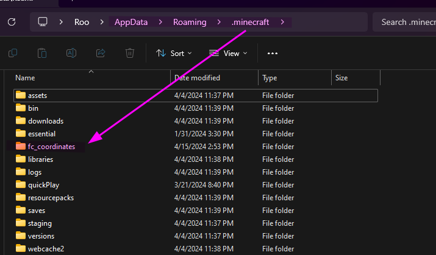

# Coordinates window
This is an optional mode for the coordinates mod that allows for a new window to be opened, which is seperate from the main one.

## How-to
Download the zip folder named [fc_coordinates](fc_coordinates.zip) and extract it into your *.minecraft* folder. It should look like this:

After that, enable the *Window Mode* in the *Coordinates* module and it should work!
